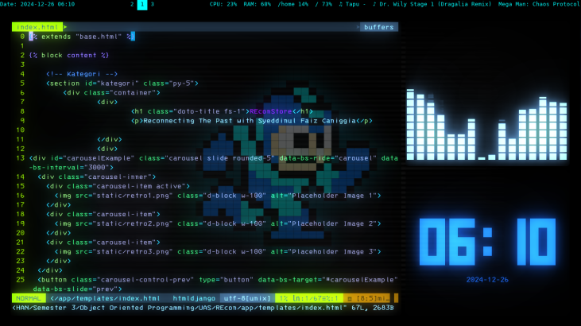
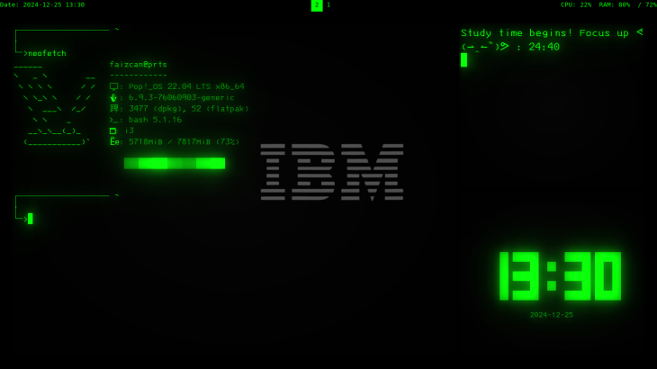
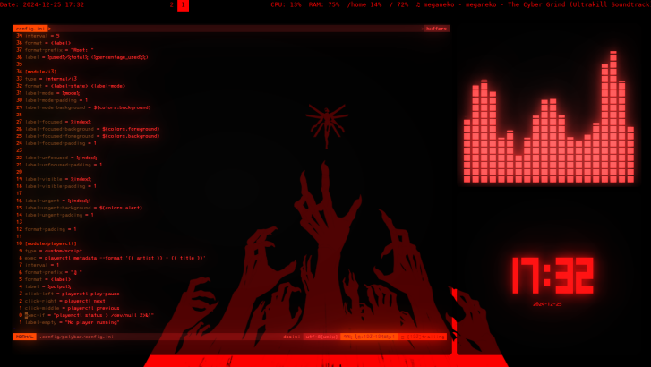

# My Config File


## Dependencies

Here are the dependencies used in this project:

- [Cool-Retro-Term](https://github.com/Swordfish90/cool-retro-term)
- Dunst 'for notification'
- Polybar
- Rofi

you will find a usr dirrectory. just copy to the /usr at root
```
/usr/share/rofi/themes/

└── dmenu.rasi
```

## Images

| Blue | Green | Red |
|------------|-------------|-----------|
|  |  |  |
| Retro Blue (Megaman) | Retro Green (The Matrix) | Retro Green (ULTRAKILL) |

## Disclaimer

I do not own any copyright to the wallpaper used in this project. All rights to the images and wallpapers belong to their respective owners. If you are the copyright holder and would like me to remove the content, please contact me, and I will comply promptly.
